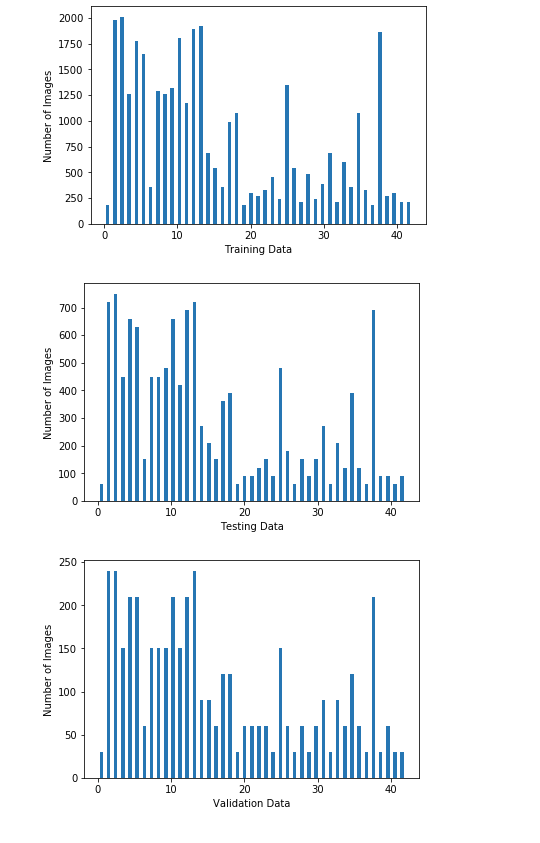
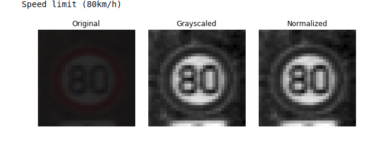
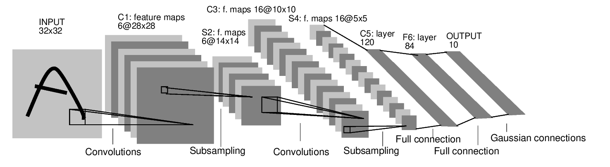
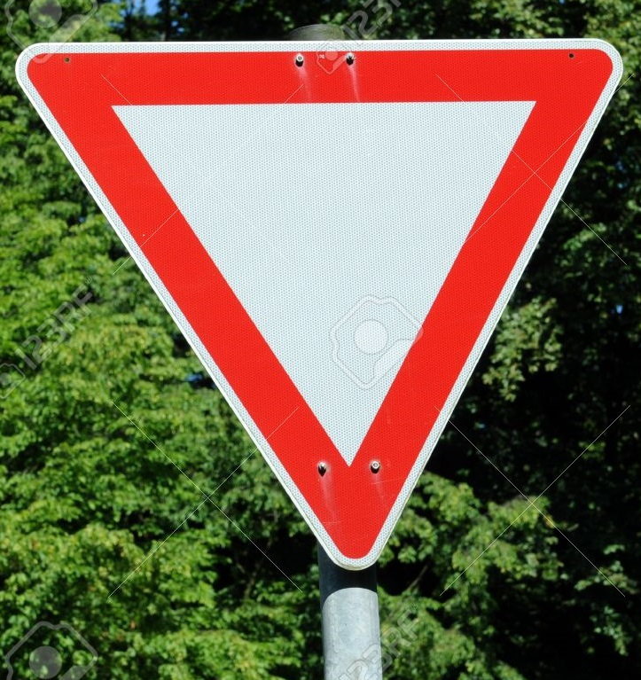
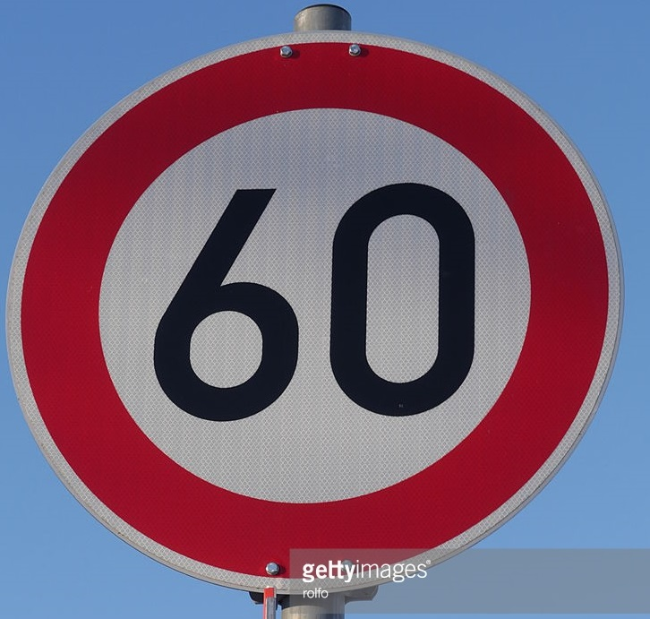
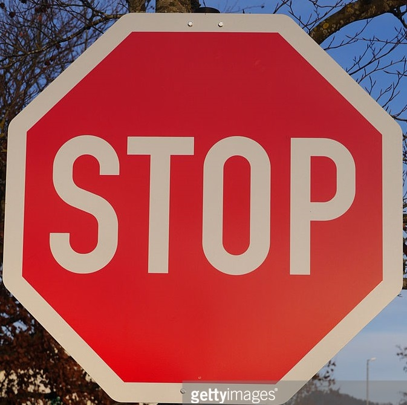
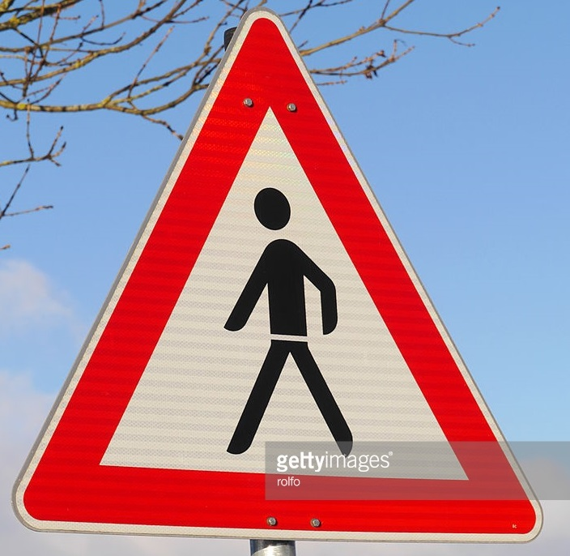
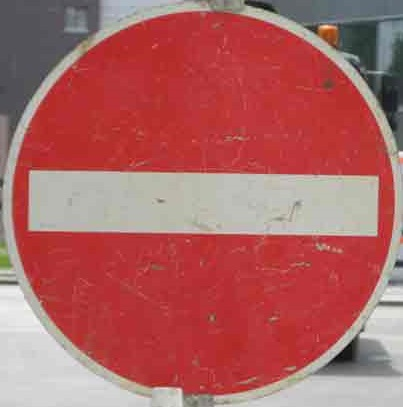
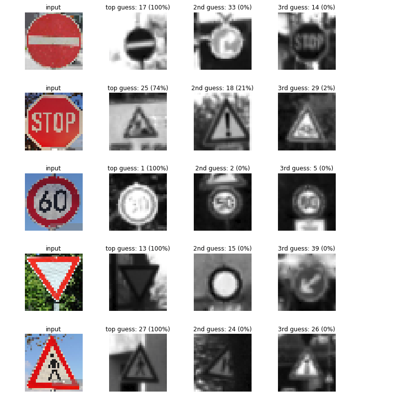

# **Traffic Sign Recognition Using LeNet** 

## Deep Learning

**Build a Traffic Sign Recognition Project**

The steps of this project are the following:
- Load the data set (see below for links to the project data set)
- Explore, summarize and visualize the data set
- Design, train and test a model architecture
- Use the model to make predictions on new images
- Analyze the softmax probabilities of the new images

[//]: # (Image References)

[image1]: ./examples/visualization.jpg "Visualization"
[image2]: ./examples/grayscale.jpg "Grayscaling"
[image3]: ./examples/random_noise.jpg "Random Noise"
[image4]: ./examples/placeholder.png "Traffic Sign 1"
[image5]: ./examples/placeholder.png "Traffic Sign 2"
[image6]: ./examples/placeholder.png "Traffic Sign 3"
[image7]: ./examples/placeholder.png "Traffic Sign 4"
[image8]: ./examples/placeholder.png "Traffic Sign 5"

### Data Set Summary & Exploration

* The size of training set is 34799
* The size of the validation set is 4410
* The size of test set is 12630
* The shape of a traffic sign image is (32, 32, 3)
* The number of unique classes/labels in the data set is 43

Here is an exploratory visualization of the data set. 

### Picture Preprocessing

* Convert to grayscle: The color in the image will not help us identify the sign, so converting the image to grayscale would help us improve the accuracy. 
* Normalized the pictures so they would have lower mean values. A wider distribution in the data would make it more difficult to train using a singlar learning rate. 

### LeNet Architecture

The parameters I used are:

* Batch size: 100
* Epochs: 30
* Learning Rate: 0.0009
* Dropout Keep Probability: 0.5

Final model results were:

* validation set accuracy of 96.5%
* test set accuracy of 94%

Only the orignial LeNet is implemented. I used an iterative approach to get the result. Generally, a larger epoch number would get a higher accuracy, but with enough epoch the accuracy would not increase after a point. The dropout would reduce the overfitting of the network. 

* Learning rate : 0.01-90%
* Learning rate: 0.001-92.3%
* Learning rate: 0.0001-93.1%
* Learning rate: 0.0009-94%

### Test the Model on New Images

Here are five German traffic signs that I found on the web:

  
 

#### Test result analysis

The test accuracy is 60%, which is not high. Here is the guess results.

 

We can see that stop signs and speed signs are hard to identify. Perhaps this is due to that the quality of the original trainning data is low. Particularly, speed signs are hard to identify because they all have the same shape. 
